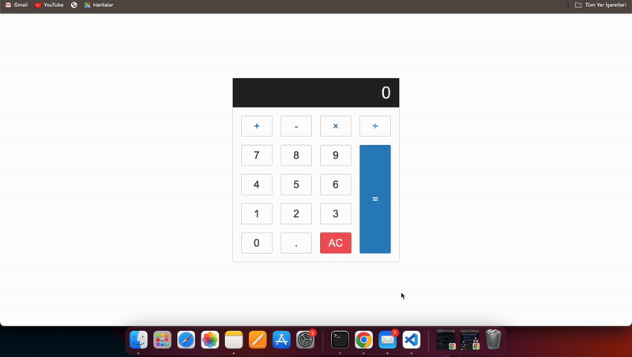

<h1>Calculator App</h1>
This project was created using Html  
Css  
Javascript. 
 It is a calculator website. 
 This website can be used to perform addition, subtraction, multiplication and division operations. Enter the numbers and choose the math operation you want to perform.
  

 